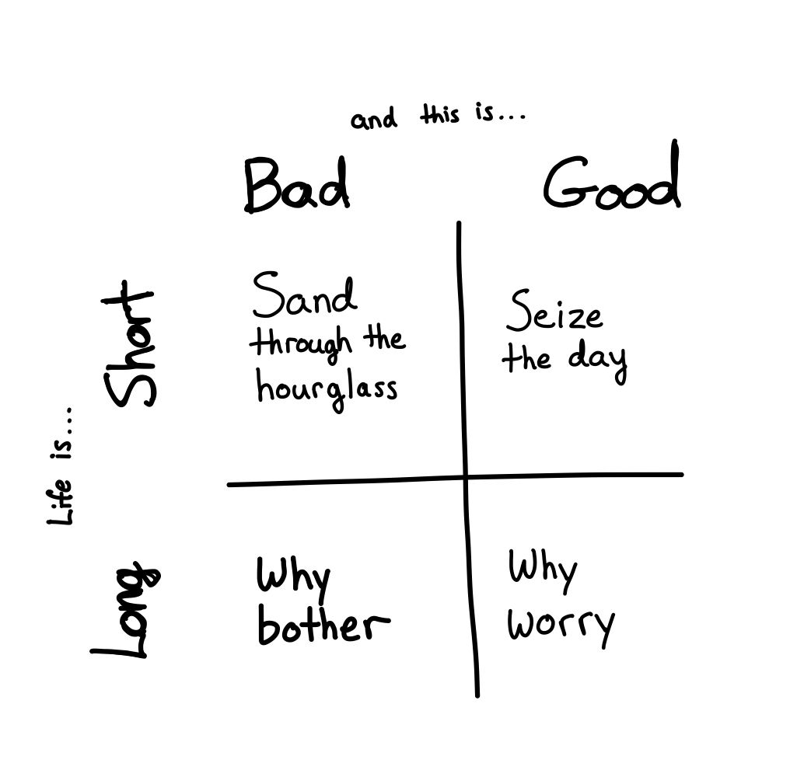

My experience of really realizing I would die came around the age of 10 or 11. The sensation was not intellectual. It had the same concrete urgency of anticipating Christmas morning presents.

Maybe you've played this game: Christmas is five days away, but tomorrow it will only be four days, and after that, only three, then two, then it will be tomorrow. This makes it feel immanent.

One day, the end of my life will be tomorrow. This was hard to take as a kid. I started having panic attacks. The situation seemed hopeless, and much of my young life was spent trying to figure out how to arrange my life in relation to this truth.

And it was truth to me. The immanence of death felt more true than anything else I'd experienced. I felt like I had opened my eyes, and despite traumatic attacks, I felt like I was seeing things clearly. As each attack faded, I felt like I was just settling into the illusion I'd been fed that enabled me to live in normal society, but which wasn't true.

My parents told me I was misinterpreting life and death, that it was just anxiety, or that the right and healthy thing was not to think about such things. But I was convinced it was true and important.

That didn't mean my reaction to it was necessarily the correct one. I could see that just because the immanence of death was true didn't mean that it had to be something that triggered horror in me. I'd had enough experience that I realized the horror wasn't in the reality, it was in how my mind interacted with that reality.

So the focus of my life became answering the question: how do I live my life in a way that this truth isn't so painful.

### Asking the Right Question
We all die. Knowing this, how can we live a life of meaning, since everything we experience will end? The best answer I've come across is that mortality, the fact that our lives are finite, is precisely the thing that gives our lives meaning.

Honestly, this perspective always seemed like trying to put a positive spin on something that was intrinsically bad. Yes, it has given my life meaning, in the sense that my life has been a response to this realization and a desperate attempt to make peace with it. In that sense, my awareness of the immanence of death has driven me and shaped my life, but I wouldn't say it has given me a sense of meaning. Running from something bad is not the same as having something good.

It turns out that there are many ways to interpret the idea that "mortality gives our lives meaning." Most of them are wrong.

All but a few seem to fall somewhere along the "life is short/long" axis and the "this is inspiring/fear inducing" axis. Each of these has its draws, but ultimately all of them have left me unfulfilled and they fall apart under scrutiny.

This might seem like all hope is lost, but when all available answers fail to meet the needs of the question, they serve as guides to a completely different level of asking.

But before we can get to that new level, we need to explore the most common approaches to the question. So, I present my vast oversimplification of humanity's attempts to answer the most vexing question we know:

### Sand through the hourglass - Life is short, and this is scary
When we say that life is short, I don't think it is an assertion that 70-90+ years is a short amount of time. I think it means that when we come to the end of our lives, it is very easy to feel the same as we do right now: that we've got a lot left to do and there's never enough time to do it.

This makes life's finiteness scary. There are only so many experiences you can have, and time is running out. Even fretting about which experience to have eats up precious time. But acting without thought would be wasteful. After all, how do I know what is the best use of my time?

I call this the "sand in the hourglass" interpretation of the finite nature of life. This is not a great way to live. I won't say it's wrong, but it values life as the sum of its moments. This doesn't make sense for two reasons I can come up off the top of my head:

How you value a moment will change over the course of your life. You might come to regret spending your twenties partying (or introverting), but at the time, that felt like the most valuable way to spend your time.
You don't even know in the moment what a good use of your time is, since overworking might mean missing that creative spark that changes the world. In fact, even if you died miserable, your life might have left a positive impact without your knowledge.
Clearly we cannot just sum up our moments.

### Seize the day - Life is short, and this is inspiring
On the other hand, "life is short" is a reminder to make every moment count. Don't put stuff off! Follow your dreams! Do the stuff that lights you up!

This is the "seize the day" approach. It's a simple reframing of "sands in the hourglass" which doesn't deny the fact that moments are fleeting.

I've usually seen this as the emotionally mature response to the realization that life is short. It ought to inspire me to spend my time on the things I really value, rather than driving me with fear. However, it's a lot of pressure, and as soon as I start falling behind, it becomes very easy to slip back into the hourglass mentality.

It's definitely better than the anxiety-inducing hourglass, since it encourages engagement. But sometimes, we don't want to be engaged, and this attitude tends to bring along a really powerful push to "do something big" or "live your dreams." Someone who lives a quiet, unassuming life might be accused of failing to live up to their potential or even wasting this life.

And what about working on things that might not go anywhere? A math proof that may not be possible, or a scientific inquiry that proves fruitless? Are these lives wasted? How could the people living them have known before trying?

Which is why this perspective is just as faulty as "sands in the hourglass." All lives are meaningful. That's a baseline assumption for me. The goal is to feel it.

That brings us to the other side of the coin:

### Why worry - Life is long, so don't worry so much
The thing is, there really is enough time, almost by definition. When you're dead, there's no self to feel like stuff was left unfinished.

So, don't worry about it. Do what you like, as you like, at the pace you like.

And I've found that there is generally plenty of time. In my twenties, I thought I'd never have time to become strong because I didn't start weightlifting in high school, but I started and got strong within a year or two. Then in my thirties, I thought I'd destroyed my career prospects because I got the wrong education, but I went back to school and got a job in tech within a few years.

We may think we're out of time, but if we just start, it's quite amazing what we can accomplish is 2-5 years, which isn't that much time to take.

This perspective can take the pressure off, and in a sense, it is required to maintain my sanity and avoid burn-out. But when I keep using it to justify vegging out and binging Disney+ it turns into...

### Why bother - Life is long, so don't even bother
The thing is, life is what it is. Working so hard to change it is burdensome and puts me under constant pressure. And the thing is, to make sense, all lives have to be meaningful. That means even people who never get to pursue their dreams or seize the day or travel must also be living meaningful lives. That's the whole point of universal human value and compassion, which is something I advocate.

So if that's the case, then it really doesn't matter what I do. My life is meaningful even if it is spent watching reruns of Star Trek for days on end.

Except, that's not really what I want. Not when I have the wherewithal to think about it and the belief, the conviction, that I could do what I want to do. When that happens, I move back into one of the first two.

And the cycle continues.

### A new framing for the question
I don't have an answer. I've been riding this merry-go-round for the last 15 years.

But I do have a new idea to contribute. When a problem seems intractable in mathematics or philosophy, I've found it's because we're framing it in the wrong way, or imposing artificial constraints.

In this case, the framing of time as something to be spent seems a little too convenient. After all, time is not money, however useful in everyday life that correlation might be.

So we throw out the idea that life is "short," or "long." This makes sense because we don't actually know how much time our lives will encompass, and these are relative terms anyway.

So what can we say? Life is simply finite. It is given to us for not apparent reason, and it can be taken at any time, neither a privilege nor an expectation. In that case, the notion of a gift seems like an apt comparison.

Death then isn't a penalty or a punishment, since it comes without consideration of whether we live good or bad lives, short or long. It's just a reminder for us to enjoy the ride and be kind to our fellow passengers.

### A new perspective on death
Under this view, death serves as a reminder to be accountable about how we engage with our time. If life were not finite, there wouldn't be a strong reason to ask ourselves if we are doing what we want, or if we only care about achieving certain goals because others want us to. If we had infinite time, we could pursue anyone's values without losing anything.

But since we don't have infinite time, how we engage with it matters and we are compelled to use it in a way that feels rewarding, given the circumstances.

The goal is not to look forward to a meaningful life, or to look back on a trail of achievement. The goal is to feel meaningful now.

That requires a shift in mindset, to look for meaning as a way we relate to our time, rather than something we find in the world. The way to live a meaningful life actually has nothing to do with the quality of our external circumstances or actions. "Living a meaningful life" turns out to be the wrong phrasing. A better way to put it would be "learning to see the meaning in life."

And how do we get better at seeing the meaning that's already there?

* Live life according to your values. Find ways to enact your values in the circumstances you have. Live with character and integrity.
* Connect to something bigger than yourself. Cultivate compassion for fellow humans, learn to appreciate some aspect of timeless culture, or immerse yourself in nature.
* Embrace and internalize an awareness of the finite nature of life. Live accountable to that truth, whether that means squeezing every last drop of adrenaline out of it, or every last rerun of Star Trek.